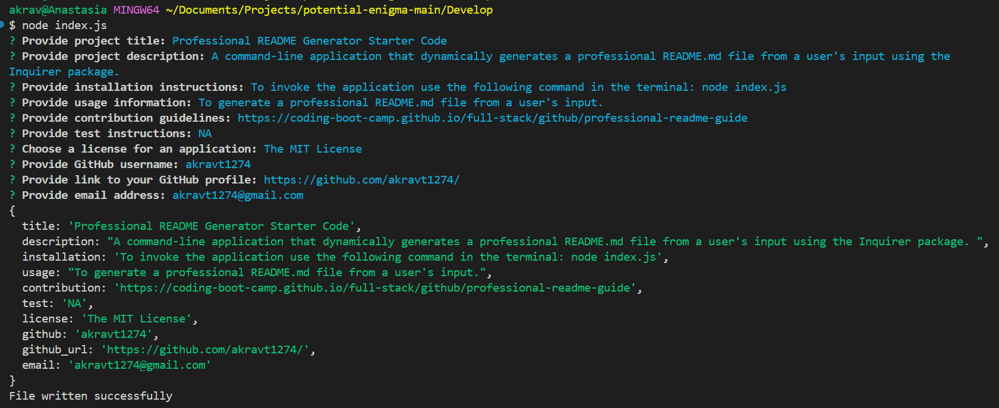
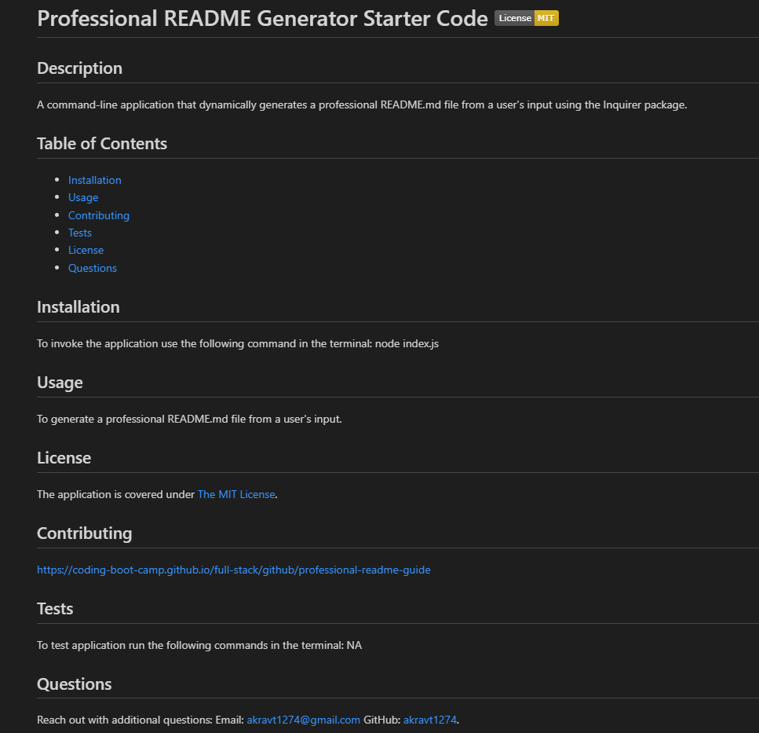

# Professional README Generator

  ## Description
  In this challenge, I created a command-line application that dynamically generates a professional README.md file from a user's input using the Inquirer package.

  ## Table of Contents
  - [Usage](#usage)
  - [Screenshots](#screenshots)
  - [Review](#review)

  ## Usage
  To invoke the application use the following command in the terminal: 
      node index.js

  ## Screenshots
  User's input: 

  

  Generated README.md file:
  - The README.md file is generated with the title of a project and sections entitled Description, Table of Contents, Installation, Usage, License, Contributing, Tests, and Questions.
  - A badge for the license is added near the top of the README if a license was provided for an application from a list of options.
  - The links in the Table of Contents are clickable and take user to the corresponding section of the README.

  

  ## Review
  The walkthrough video that demonstrates application functionality: 
  - With a license provided: https://app.screencastify.com/v3/watch/RWOGXn0i9dmHiYZxFSo0
  - Without a license: https://app.screencastify.com/v3/watch/doFGkdrhxOyZaAm1xFQw

